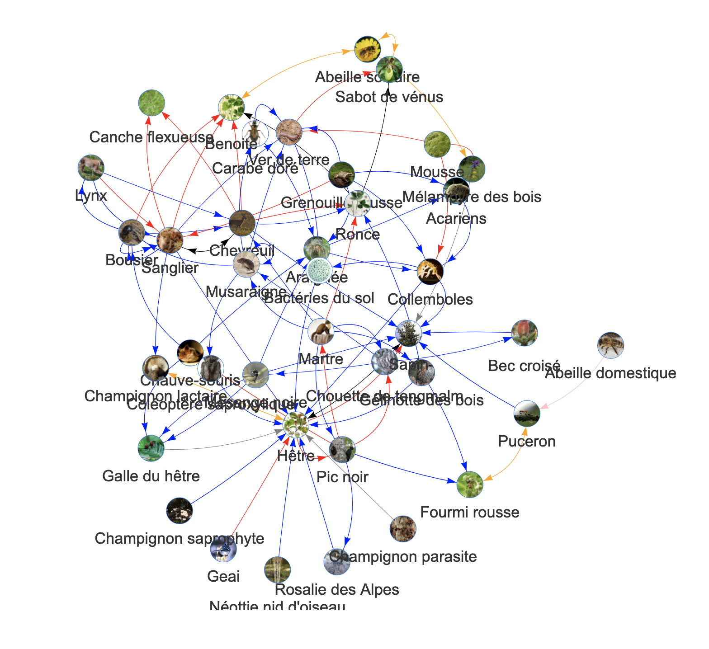

## A game where kids act the species of a network. 

The idea is that kids perform a game which consists in building an in-vivo network with children: kids play the species of an ecosystem and connect to other kids/species with ropes of different colors, mimicking different interaction types. 

This is based on the local network of species of the school where the activity is performed. For example, this was the was a network from the forest near Chambéry, France. 

Each kid is one of the species of the network (we make sure to adjust the number of species to the number of kids in the class). They receive a card with a picture of the species that they can put around their neck. 

They then stand on a circle and one of us reads the stories of the interactions. For example: "The bee collects honeydew produced by aphids". The two corresponding kids (the bee and the aphid) raise their hand and decide which interaction type they're involved in. We consider three interaction types: feeding, positive non-trophic and negative non-trophic interactions. 

The two kids choose a rope of the corresponding color of the interaction (each interaction type is associated to a rope color) and connect themselves with a rope.  

We keep going until all interactions have been read and all kids are connected to each other by many ropes of different colors. 

We then mention the names of a threatened species. The corresponding kid has to sit. She/he pulls the ropes she is holding. The corresponding kids have to sit. We keep going until all the kids are sitting. 

This is followed by a discussion about interconnectness in nature.

